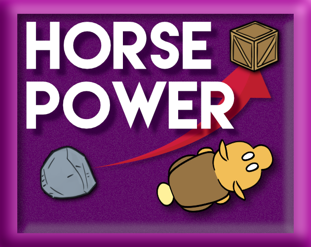
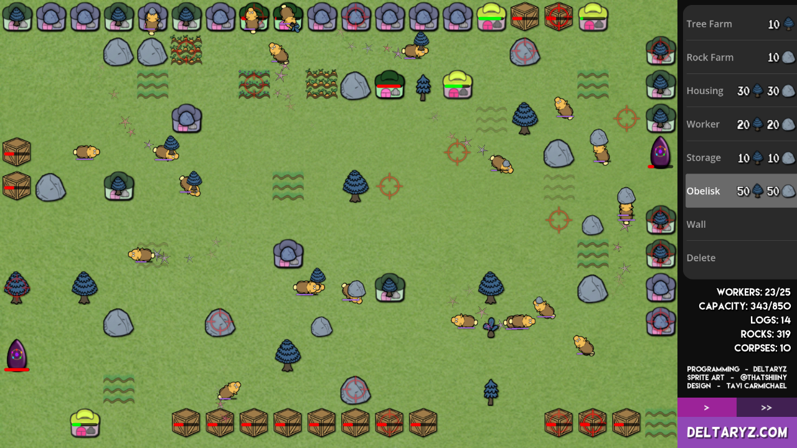

# HORSE POWER

Forge a thriving(?) civilization of not-very-colorful, not-very-magical equines in this sandbox simulation. Supporting hundreds of workers, HORSE POWER has been known to send playtesters and developers alike into inescapable trances, unable to look away from the mesmerizing simulation on the screen in front of them. You have been warned.

This was a submission for [Godot Wild Jam #68](https://itch.io/jam/godot-wild-jam-68/rate/2661062). Due to the nature of the game jam, this project got VERY dirty and hacky in some spots (particularly in regards to file structure). Please don't judge me.

Windows, Mac, Linux, and Android clients are supported, but not iOS (sorry).

Playable at [horsepower.deltaryz.com](https://horsepower.deltaryz.com)

Hand-drawn sprite artwork provided by [Shiiiny](https://twitter.com/ThatShiiiny)

Game design and project management provided by Tavi Carmichael